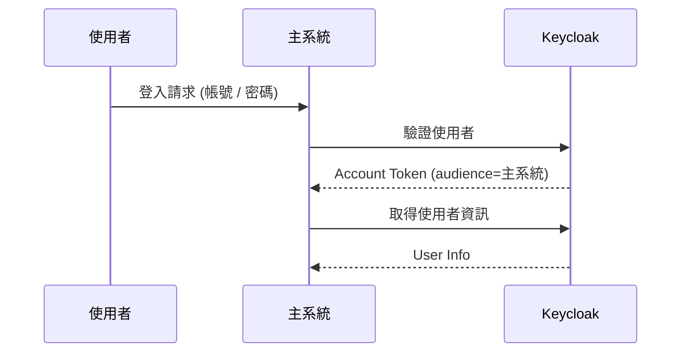
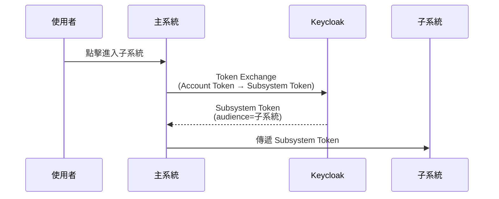
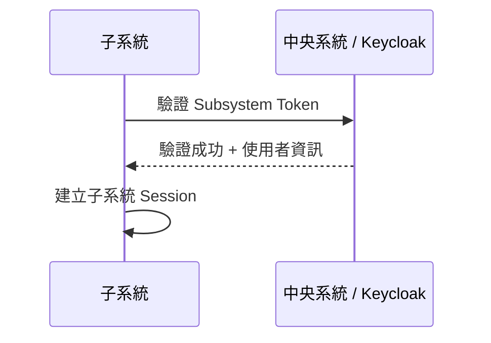
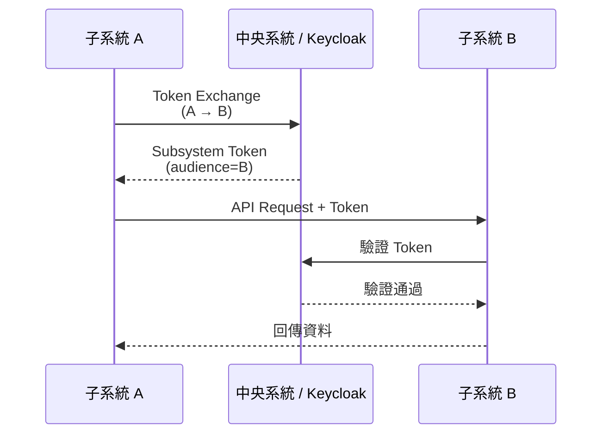

# 中央 SSO 與 Token Exchange 架構筆記

> 本文件用來記錄目前測試系統的實際設計邏輯、Token 流向、以及未來對 Smart on FHIR 情境的延伸思考。  
> 這是一份系統設計筆記，不是操作手冊，也不是對外說明文件。

---

## 1. 系統設計目標

- 使用 Keycloak 作為中央身分與授權中心
- 使用者登入 Token 不得直接被子系統使用
- 任何進入子系統的行為，必須經過 Token Exchange (Keycloak)
- 每個子系統皆擁有獨立 Client 與 Audience
- 延伸探討 : Smart on FHIR 在系統對系統資料交換時，會用這種token交換的方式讓系統跟系統間做驗證。

---

## 2. 核心觀念

### 2.1 不存在全系統通用 Token

Token 只代表：
「某個主體，在某個時間點，被授權存取某個特定 Client 的資源」

跨 Client、跨系統，一律重新授權。

---

### 2.2 Token 類型定義

本系統中，實際只存在兩種 Token：

| Token 類型 | 說明 | 使用範圍 |
|-----------|------|----------|
| 使用者 Token（Account Token） | 使用者登入主系統後，由 Keycloak 發行 | **僅限主系統使用** |
| 子系統 Token（Subsystem Token） | 透過 Token Exchange 取得，audience 指向特定子系統 Client | **僅限該子系統** |

---

### 2.3 為什麼不能共用登入 Token

- 子系統註冊 (Client / Audience) 會失去意義
- 資料交互會變成都用同一支token去做驗證，風險太大
- 權限無法單獨撤銷
- 不符合 Smart on FHIR 與 Zero Trust

結論：
**進入任何子系統前，必須進行 Token Exchange**

---

## 3. 系統流程

### 3.1 使用者登入主系統

1. 使用者登入主系統
2. 主系統向 Keycloak 驗證帳密
3. Keycloak 回傳 Access Token (account)
4. 主系統取得使用者資訊

---

### 3.2 進入子系統（Token Exchange）

1. 使用者點擊子系統
2. 主系統向 Keycloak 進行 Token Exchange
3. 換取 audience 指向子系統的 Token (要設定此子系統允許主系統做token交換)
4. 傳遞給子系統

---

### 3.3 子系統驗證

1. 子系統收到 Token
2. 向中央系統 / Keycloak 驗證
3. 建立子系統 Session
4. 透過此Token獲取使用者資訊

---

## 4. 延伸議題
### 子系統間資料交換（Smart on FHIR）

1. 子系統 A 需要呼叫子系統 B API
2. 子系統 A 進行 Token Exchange (由中央的api)
3. 取得 audience = 子系統 B 的 Token
4. 呼叫子系統 B
5. 子系統 B 驗證 Token 合法性
6. 驗證通過後回傳資料

**進行token exchange之前，除非B系統有設定允許A系統的token交換，否則A系統也無法換成B系統的token**
---

### Smart on FHIR 對應

| Smart on FHIR | 本系統 |
|--------------|--------|
| Authorization Server | Keycloak |
| Backend Service | 子系統 Client |
| Audience | 子系統 Client ID |
| System-to-System | 子系統 API 呼叫 |
| Token 驗證 | 中央系統 / Keycloak |

---

### 設計原則總結

- 使用者 Token ≠ 子系統 Token
- Token 不跨 Client
- 跨系統必須重新授權
- Token Exchange 是系統邊界
- 子系統不直接信任彼此，皆要由中央系統管理

## 示意圖
### 使用者登入主系統（account token）

### 進入子系統（Token Exchange）

### 子系統驗證與登入

### 延伸議題 : 子系統之間資料交換（Smart on FHIR 延伸）

