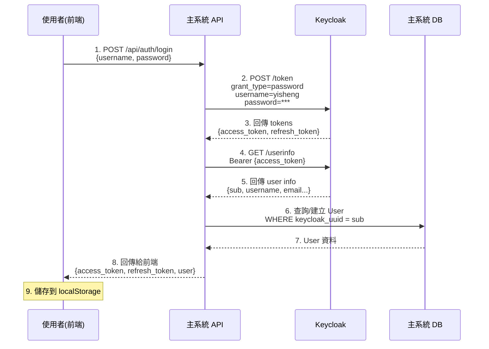
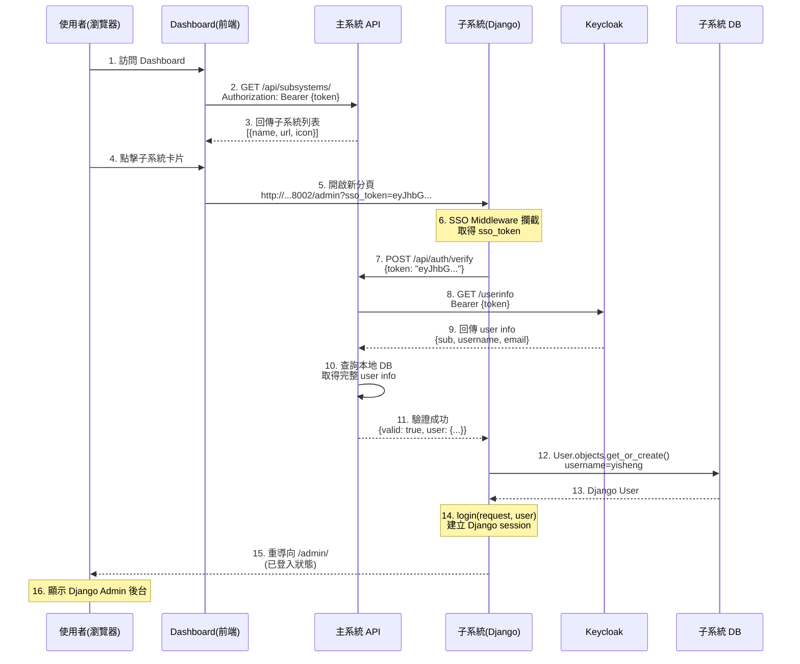
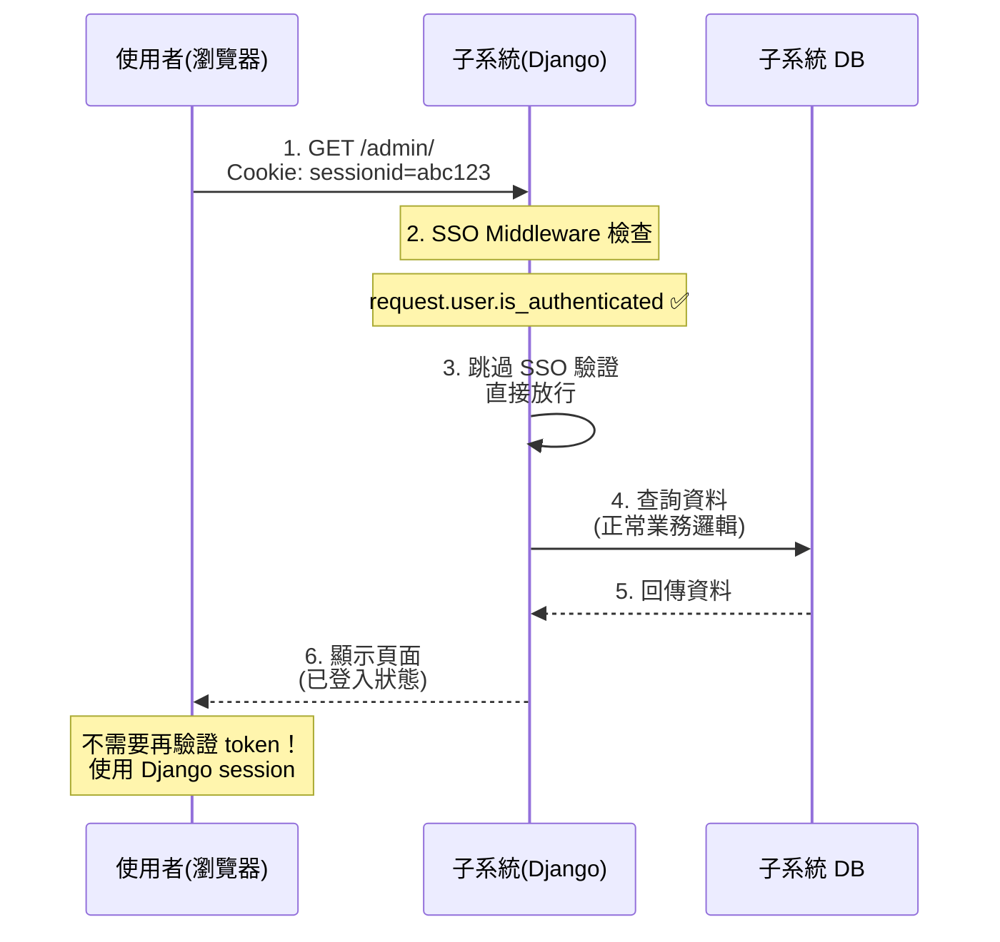
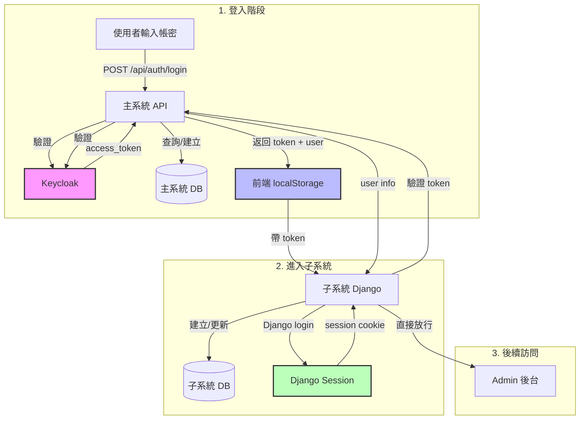
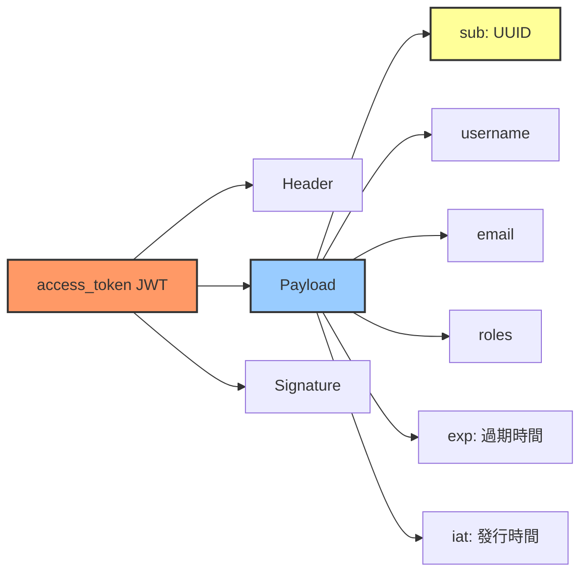

## OAuth2.0 正規流程
```
1. 使用者在主系統點「進入子系統 B」
   ↓
2. 主系統導向 Keycloak（SSO）
   說：「我要去子系統 B，幫我驗證使用者身分」
   ↓
3. Keycloak 檢查：
   - 使用者是否已登入？
   - 子系統 B 的 redirect_uri 是否在白名單？
   ↓
4. Keycloak 驗證 OK，帶著「授權碼 (code)」導向子系統 B
   URL: http://subsystem-B.com/auth/callback/?code=ABC123
   ↓
5. 子系統 B 收到 code，用「自己的 client_secret」去問 Keycloak：
   「這個 code 是真的嗎？給我 access_token」
   ↓
6. Keycloak 回應：「OK，這是你的 access_token」
   ↓
7. 子系統 B 拿這個 token 再去問 Keycloak（不是主系統！）：
   「這個 token 代表的使用者是誰？」
   ↓
8. Keycloak 回應：
   {
     "sub": "user-uuid",
     "email": "user@example.com",
     "name": "張三"
   }
   ↓
9. 子系統 B 建立自己的 session，使用者登入成功！
```


## Keycloak SSO 整合設定指南

### 架構說明
當使用 Keycloak 作為 SSO (Single Sign-On) 認證中心時，主系統需要透過 Keycloak API 來管理使用者帳戶。這樣可以確保所有使用者資料集中管理，實現真正的單一登入功能。

### 為什麼需要這些設定？
- **Client authentication**: 確保只有經過授權的應用程式可以呼叫 Keycloak API
- **Service accounts roles**: 讓應用程式能以「服務帳戶」身份呼叫管理 API，無需使用者介入
- **manage-users 權限**: 允許主系統透過 API 創建、修改、刪除 Keycloak 中的使用者

---

## 一、建立 Keycloak Client

### 1. 進入 Keycloak Admin Console
```
URL: http://your-keycloak-server:8080/admin
```
- 使用管理員帳號登入
- 選擇對應的 Realm（例如：djangoSSO）

### 2. 建立新的 Client
1. 左側選單點選 **Clients**
2. 點選右上角 **Create client** 按鈕
3. 填寫基本資訊：
   - **Client type**: OpenID Connect
   - **Client ID**: `djangosso`（或你的主系統名稱）
   - 點選 **Next**

### 3. 設定 Capability config（能力設定）
在第二步設定頁面中：

#### 必須啟用：
- ✅ **Client authentication**: `ON`
  - **用途**: 啟用後 client 需要提供 client_secret 才能呼叫 API
  - **重要性**: 這是安全性的基礎，確保只有你的後端服務能呼叫 API

#### 可選設定：
- ⚪ **Authorization**: `OFF`
  - **說明**: 細粒度授權控制，一般應用不需要
  
#### Authentication flow（認證流程）：
根據你的需求勾選：
- ✅ **Standard flow**: 啟用標準的 OAuth2 授權碼流程
  - **用途**: 使用者透過瀏覽器重導向到 Keycloak 登入頁面
  - **使用時機**: 網頁應用的使用者登入（GET /auth/login）
  - **流程**: 使用者 → Keycloak 登入頁 → 輸入帳密 → 重導向回主系統
  
- ✅ **Direct access grants**: **必須啟用**（用於帳號密碼登入）
  - **用途**: 允許使用帳號密碼直接換取 token
  - **使用時機**: 
    - ✅ 前端直接呼叫 POST /api/auth/login（你現在的情況）
    - ✅ 行動 APP 登入
    - ✅ 測試環境
  - **⚠️ 重要**: 如果不啟用此選項，使用者帳號密碼登入時會收到錯誤：
```json
    {"error": "unauthorized_client", "error_description": "Client not allowed for direct access grants"}
```
  
- ✅ **Service accounts roles**: **必須啟用**（用於管理 API）
  - **用途**: 允許此 client 以「服務帳戶」身份呼叫 Keycloak Admin API
  - **使用時機**: 主系統需要管理使用者（創建、修改、刪除）
  - **流程**: 主系統後端用 client_credentials 取得 admin token → 呼叫 Admin API
  - **⚠️ 重點**: 這是讓主系統能創建使用者的關鍵設定

點選 **Save** 儲存

---

## 二、設定 Service Account 權限

### 為什麼需要這一步？
雖然已啟用 Service accounts roles，但預設沒有任何權限。我們需要明確給予「管理使用者」的權限。

### 操作步驟：

#### 1. 進入 Service account roles 設定
- 在 Client 詳細頁面，點選上方 **Service account roles** 標籤

#### 2. 指派角色（Assign roles）
- 點選 **Assign role** 按鈕
- 在彈出視窗中：

#### 3. 切換到 Client roles
- 找到 **Filter by clients** 或 **Client roles** 的選項
- 從下拉選單選擇 **`realm-management`**
  - **說明**: `realm-management` 是 Keycloak 內建的管理用 client，包含所有管理相關的角色

#### 4. 選擇必要的角色
在 Available roles 列表中，勾選以下三個角色：

| 角色名稱 | 用途說明 | 必要性 |
|---------|---------|--------|
| ✅ `manage-users` | 創建、修改、刪除使用者 | 必須 |
| ✅ `view-users` | 查詢、檢視使用者資料 | 必須 |
| ✅ `query-users` | 搜尋使用者 | 建議 |

#### 5. 確認指派
- 點選 **Assign** 或 **Add selected** 按鈕
- 確認這三個角色出現在 **Assigned roles** 列表中

---

## 三、取得 Client Secret（金鑰）

### 1. 進入 Credentials 標籤
- 因為已啟用 **Client authentication**，會出現 **Credentials** 標籤
- 點選 **Credentials** 標籤

### 2. 複製 Client Secret
- 找到 **Client secret** 欄位
- 點選「複製」圖示或手動複製金鑰
- **⚠️ 重要**: 這個 secret 要保管好，不要洩漏

### 3. 設定到主系統
將取得的資訊設定到主系統的環境變數（`.env` 檔案）：
```bash
# Keycloak 設定
KEYCLOAK_URL=http://172.27.207.106:8080
KEYCLOAK_REALM=djangoSSO                    # 你的 Realm 名稱
KEYCLOAK_CLIENT_ID=djangosso                # Client ID
KEYCLOAK_CLIENT_SECRET=uqAb...              # 從 Credentials 標籤複製的 secret
```

---

## 四、整合流程說明

### 使用者創建流程
```
1. 前端發送創建使用者請求
   ↓
2. 主系統後端接收請求
   ↓
3. 主系統使用 client_credentials 向 Keycloak 取得 admin token
   POST /realms/{realm}/protocol/openid-connect/token
   {
     "grant_type": "client_credentials",
     "client_id": "djangosso",
     "client_secret": "your-secret"
   }
   ↓
4. 主系統使用 admin token 呼叫 Keycloak Admin API 創建使用者
   POST /admin/realms/{realm}/users
   {
     "username": "...",
     "email": "...",
     "credentials": [...]
   }
   ↓
5. Keycloak 回傳使用者 UUID
   ↓
6. 主系統將 UUID 存入本地資料庫
   ↓
7. 回傳成功訊息給前端
```

### 使用者登入流程（標準 OAuth2 流程）
```
1. 使用者訪問主系統
   ↓
2. 主系統重導向到 Keycloak 登入頁面
   GET /realms/{realm}/protocol/openid-connect/auth?
       client_id=djangosso&
       redirect_uri=http://main-system/callback&
       response_type=code
   ↓
3. 使用者在 Keycloak 輸入帳號密碼
   ↓
4. Keycloak 驗證成功，重導向回主系統並帶上 code
   http://main-system/callback?code=xxx&state=yyy
   ↓
5. 主系統用 code 換取 access_token
   POST /realms/{realm}/protocol/openid-connect/token
   {
     "grant_type": "authorization_code",
     "code": "xxx",
     "client_id": "djangosso",
     "client_secret": "your-secret",
     "redirect_uri": "http://main-system/callback"
   }
   ↓
6. 主系統取得 access_token，查詢使用者資訊
   GET /realms/{realm}/protocol/openid-connect/userinfo
   Authorization: Bearer {access_token}
   ↓
7. 主系統給前端 access_token
   ↓
8. 使用者點擊子系統
   ↓
9. 前端帶著 token 訪問子系統
   ↓
10. 子系統向「主系統」驗證 token ← 重點！
   ↓
11. 主系統驗證成功，回傳使用者資訊
   ↓
12. 子系統允許訪問
```


---

## 五、驗證設定是否正確

### 1. 檢查 Service Account Roles
在 **Service account roles** 標籤中，應該看到：
```
Assigned roles:
├─ realm-management
│  ├─ manage-users
│  ├─ view-users
│  └─ query-users
└─ default-roles-djangosso
```

### 2. 測試 API 連線
使用以下 Python 程式碼測試：
```python
import httpx
import asyncio

async def test_keycloak():
    # 1. 取得 admin token
    token_url = "http://your-keycloak:8080/realms/djangoSSO/protocol/openid-connect/token"
    data = {
        "grant_type": "client_credentials",
        "client_id": "djangosso",
        "client_secret": "your-secret"
    }
    
    async with httpx.AsyncClient() as client:
        # 取得 token
        response = await client.post(token_url, data=data)
        if response.status_code != 200:
            print(f"❌ 取得 token 失敗: {response.text}")
            return
        
        token = response.json()["access_token"]
        print(f"✅ 成功取得 admin token")
        
        # 測試創建使用者
        users_url = "http://your-keycloak:8080/admin/realms/djangoSSO/users"
        headers = {
            "Authorization": f"Bearer {token}",
            "Content-Type": "application/json"
        }
        user_data = {
            "username": "testuser",
            "enabled": True,
            "credentials": [{
                "type": "password",
                "value": "password123",
                "temporary": False
            }]
        }
        
        response = await client.post(users_url, json=user_data, headers=headers)
        if response.status_code == 201:
            print(f"✅ 成功創建使用者")
        else:
            print(f"❌ 創建使用者失敗: {response.status_code} - {response.text}")

asyncio.run(test_keycloak())
```

### 3. 預期結果
- 200: token 取得成功
- 201: 使用者創建成功
- 403: 權限不足（檢查 Service Account Roles）
- 401: 認證失敗（檢查 client_secret）
- 409: 使用者已存在

---

## 六、常見問題排除

### Q1: 出現 "Client not enabled to retrieve service account" 錯誤
**原因**: 沒有啟用 Service accounts roles  
**解決**: 回到 Client Settings，確認 **Service accounts roles** 是 `ON`

### Q2: 出現 "HTTP 403 Forbidden" 錯誤
**原因**: Service account 沒有 manage-users 權限  
**解決**: 檢查 Service account roles 標籤，確認已指派 `manage-users`、`view-users`、`query-users`

### Q3: 出現 "Realm not found" 錯誤
**原因**: Realm 名稱錯誤（注意大小寫）  
**解決**: 確認 `.env` 中的 `KEYCLOAK_REALM` 與 Keycloak 中的 Realm 名稱一致

### Q4: 出現 "unauthorized_client" 錯誤
**原因**: client_secret 錯誤  
**解決**: 重新複製 Credentials 標籤中的 Client Secret

### Q5: Token 取得成功，但創建使用者失敗
**原因**: Token 是一般使用者的 token，不是 service account 的  
**解決**: 確認使用 `grant_type=client_credentials`，而非 `password`

---

## 七、安全性建議

### 1. Client Secret 保護
- ❌ 不要將 secret 寫死在程式碼中
- ✅ 使用環境變數或密鑰管理系統
- ✅ 定期輪換 secret

### 2. Token 管理
- Token 有效期通常是 5 分鐘（300 秒）
- 不要快取 admin token
- 每次需要時重新取得

### 3. 最小權限原則
- 只給予必要的角色
- 如果只需要查看使用者，不要給 manage-users
- 考慮建立專門的 service account client

### 4. 網路安全
- 生產環境必須使用 HTTPS
- 限制 Keycloak 的網路存取
- 使用防火牆規則

---

## 八、相關文件

- [Keycloak Admin REST API](https://www.keycloak.org/docs-api/latest/rest-api/)
- [Keycloak Service Accounts](https://www.keycloak.org/docs/latest/server_admin/#_service_accounts)
- [OAuth 2.0 Client Credentials Grant](https://oauth.net/2/grant-types/client-credentials/)


## Mermaid 流程示意圖
🔐 流程 1：使用者登入主系統

🚀 流程 2：進入子系統 (SSO)

🔄 流程 3：後續訪問子系統 (使用 Session)

🗂️ 資料流向圖

🔑 Token 內容結構

🏗️ 系統架構圖
```mermaid
graph TB
    subgraph "前端"
        FE1[登入頁面<br/>login.html]
        FE2[儀表板<br/>dashboard.html]
        FE3[localStorage<br/>access_token, user]
    end
    
    subgraph "主系統 FastAPI"
        API1[/api/auth/login<br/>登入]
        API2[/api/auth/verify<br/>驗證 token]
        API3[/api/subsystems<br/>子系統列表]
        DB1[(PostgreSQL<br/>users 表)]
    end
    
    subgraph "Keycloak SSO"
        KC1[/token<br/>發行 token]
        KC2[/userinfo<br/>取得使用者資訊]
        KC3[(Keycloak DB<br/>使用者儲存)]
    end
    
    subgraph "子系統 Django"
        DJ1[SSO Middleware<br/>驗證 & 登入]
        DJ2[Admin 後台]
        DJ3[(Django DB<br/>auth_user)]
    end
    
    FE1 -->|1. 登入| API1
    API1 -->|2. 驗證| KC1
    KC1 --> KC3
    API1 -->|3. 取 user info| KC2
    API1 --> DB1
    API1 -->|4. 返回 token| FE3
    
    FE2 -->|5. 取子系統列表| API3
    FE2 -->|6. 帶 token 訪問| DJ1
    DJ1 -->|7. 驗證 token| API2
    API2 -->|8. 驗證| KC2
    DJ1 -->|9. Django login| DJ3
    DJ1 -->|10. 放行| DJ2
    
    style KC1 fill:#f9f,stroke:#333,stroke-width:3px
    style DJ1 fill:#9f9,stroke:#333,stroke-width:3px
    style FE3 fill:#99f,stroke:#333,stroke-width:2px
```
